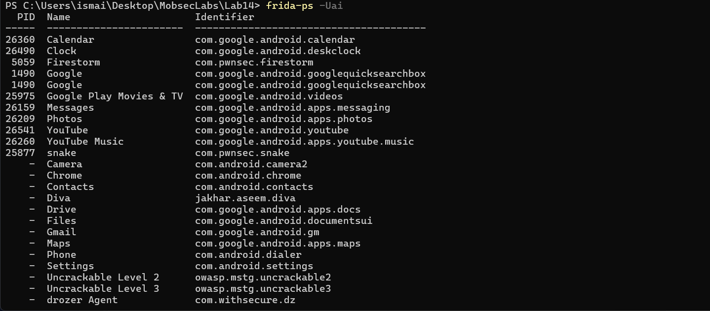
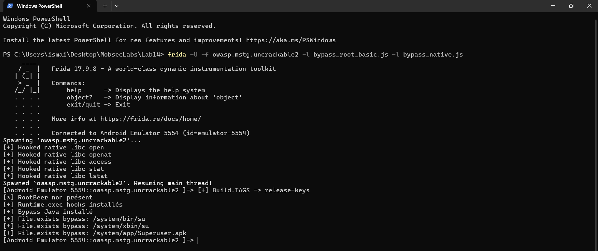
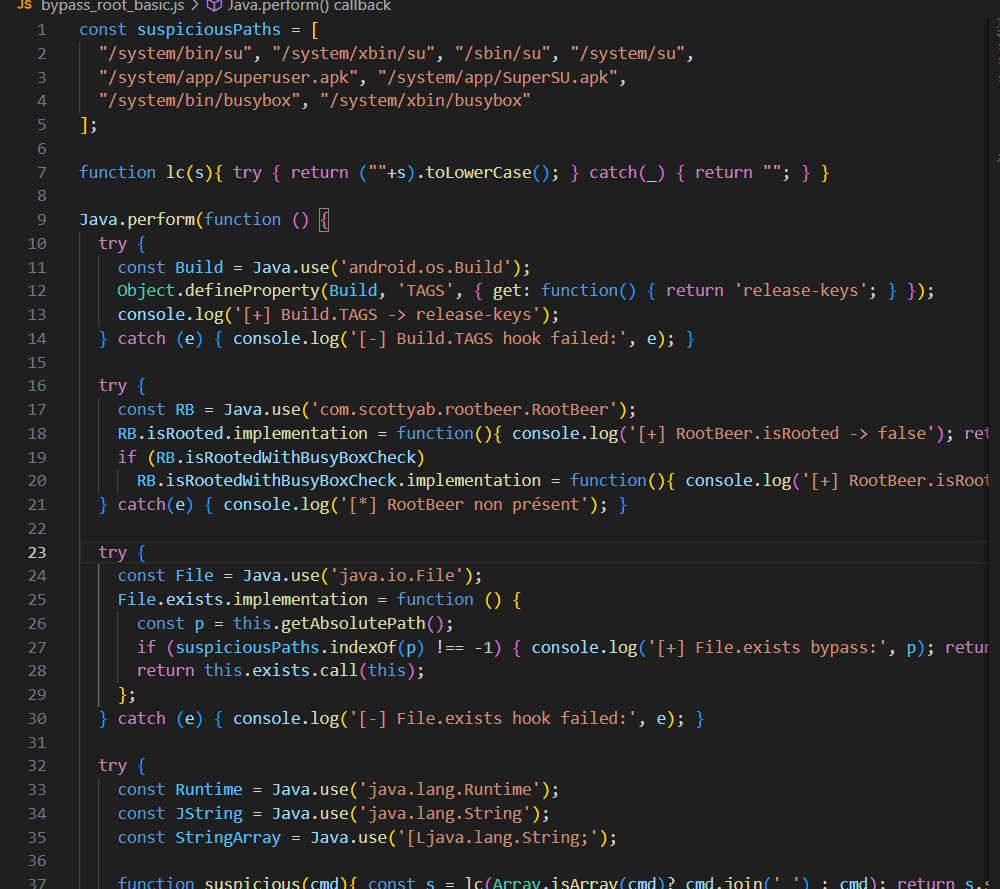
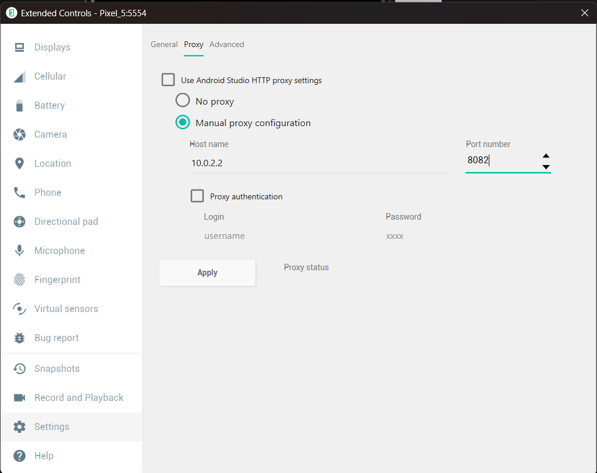
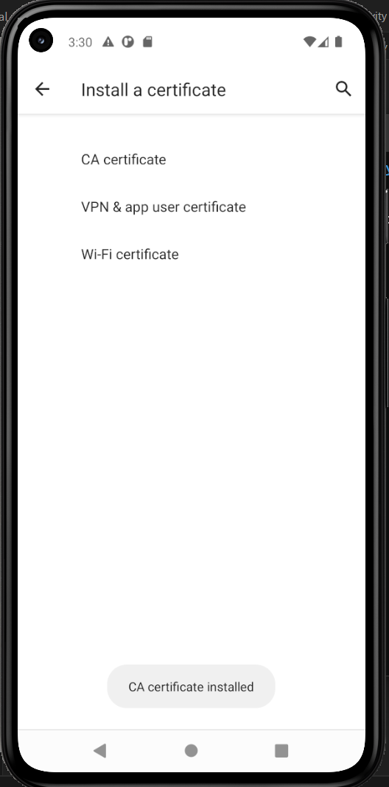

# Lab_14_MobileSecurity

Ce document décrit les étapes de résolution du Lab 14 pour contourner la détection de root sur Android à l'aide de Frida (Java et natif) et Objection.

## Étape 1 : Vérification de l'environnement
Nous vérifions la présence et les versions de Python, pip, et du client Frida installé sur la machine de test.

```powershell
python --version
pip --version
frida --version
```



## Étape 2 : Vérification de la connexion ADB
Nous listons les appareils connectés pour s'assurer que l'émulateur est correctement reconnu par ADB.

```powershell
adb devices
```



## Étape 3 : Démarrage du serveur Frida
Après transfert de `frida-server` (version compatible 17.9.8) dans `/data/local/tmp/` et attribution des permissions d'exécution, nous le démarrons en arrière-plan et validons le fonctionnement avec `frida-ps`.

```powershell
adb push frida-server /data/local/tmp/
adb shell chmod 755 /data/local/tmp/frida-server
adb shell "nohup /data/local/tmp/frida-server -l 0.0.0.0 >/dev/null 2>&1 &"
frida-ps -Uai
```



## Étape 4 : Contournement avec Frida (Scripts Basic Java & Native)
Nous injectons deux scripts pour contourner la détection de root :
1. `bypass_root_basic.js` : modifie `Build.TAGS`, désactive RootBeer et surcharge `File.exists` ainsi que `Runtime.exec` pour empêcher la détection de binaires comme `su`.
2. `bypass_native.js` : intercepte les appels système natifs de la `libc.so` (`open`, `openat`, `access`, `stat`, `lstat`) tentant d'accéder aux fichiers suspects.

```powershell
frida -U -f owasp.mstg.uncrackable2 -l bypass_root_basic.js -l bypass_native.js
```



## Étape 5 : Contournement automatisé avec Objection
Comme alternative, nous attachons **Objection** au processus en cours (via son PID) et exécutons la commande intégrée pour désactiver la détection de root.

```powershell
# Identifier le PID
frida-ps -U

# Attacher objection au PID correspondant
objection -g <PID> explore

# Dans le prompt objection
android root disable
```


